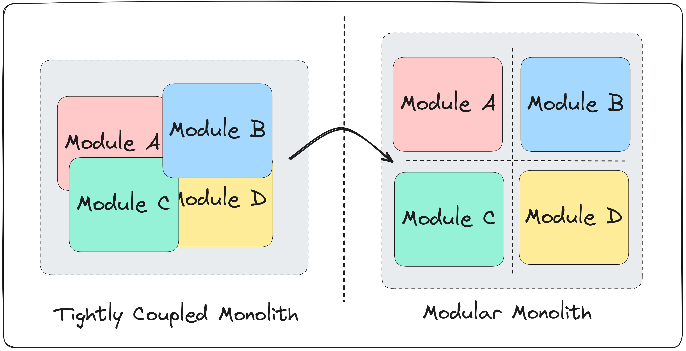

## Monoliths
A monolithic architecture is a traditional model for designing a software application where all the components are interconnected and interdependent. In this architecture, the application is built as a single, cohesive unit, and all functions run as a single process.  

**Features**:  
1. Single Codebase
2. Unified Deployment
3. Tightly Coupled
4. Shared Memory (Components share the same memory space, simplifies communication within the application)
5. Centralized Management

**Drawbacks**:  
1. Scalability Issues (Scaling parts of the application independently is difficult; the entire application must be scaled)
2. Maintenance Complexity (As the application grows, it becomes more complex and harder to understand and manage)
3. Deployment Bottlenecks (Small changes can require the entire application to be redeployed, increasing the risk of failure)
4. Limited Flexibility (Technology stack choices are limited since changing a technology affects the entire application)
5. Slow Development (Development can slow down as more teams work on the same codebase, leading to integration issues)
6. Fault Isolation (A bug in any module can potentially bring down the entire application)

## What Is a Modular Monolith?
A Modular Monolith is a software design approach in which a monolith is designed with an emphasis on interchangeable (and potentially reusable) modules.  
The problem with most monolith systems is that they become tightly coupled over time. Components are deeply intertwined. Making a change in one component impacts many others. Introducing new features is difficult and error-prone.

There are two widely used communication patterns.  
1. Synchronous Communication With Method Calls
   - Module A calls a method declared on the public API of Module B and waits until it receives a result.
2. Asynchronous Communication With Messaging
   - Module A sends a message to the message broker in a fire-and-forget fashion. Module B subscribes to relevant messages and handles them accordingly.
   - Modules don't need to know about each other, but they do need to know about the message contracts.

## Microservices
Microservices are an architectural and organizational approach to software development where software is composed of small independent services that communicate over well-defined APIs. These services are owned by small, self-contained teams.  
Microservices architectures make applications easier to scale and faster to develop, enabling innovation and accelerating time-to-market for new features.

## Monolithic vs. Microservices Architecture
With monolithic architectures, all processes are tightly coupled and run as a single service. This means that if one process of the application experiences a spike in demand, the entire architecture must be scaled. Adding or improving a monolithic application’s features becomes more complex as the code base grows. This complexity limits experimentation and makes it difficult to implement new ideas. Monolithic architectures add risk for application availability because many dependent and tightly coupled processes increase the impact of a single process failure.  
With a microservices architecture, an application is built as independent components that run each application process as a service. These services communicate via a well-defined interface using lightweight APIs. Services are built for business capabilities and each service performs a single function. Because they are independently run, each service can be updated, deployed, and scaled to meet demand for specific functions of an application.

## Characteristics of Microservices
- **Autonomous**: Each component service in a microservices architecture can be developed, deployed, operated, and scaled without affecting the functioning of other services. Services do not need to share any of their code or implementation with other services. Any communication between individual components happens via well-defined APIs.
- **Specialized**: Each service is designed for a set of capabilities and focuses on solving a specific problem. If developers contribute more code to a service over time and the service becomes complex, it can be broken into smaller services.

## Benefits of Microservices
- **Agility**: Microservices foster an organization of small, independent teams that take ownership of their services. Teams act within a small and well understood context, and are empowered to work more independently and more quickly. This shortens development cycle times. You benefit significantly from the aggregate throughput of the organization.
- **Flexible Scaling**: Microservices allow each service to be independently scaled to meet demand for the application feature it supports. This enables teams to right-size infrastructure needs, accurately measure the cost of a feature, and maintain availability if a service experiences a spike in demand.
- **Easy Deployment**: Microservices enable continuous integration and continuous delivery, making it easy to try out new ideas and to roll back if something doesn’t work. The low cost of failure enables experimentation, makes it easier to update code, and accelerates time-to-market for new features.
- **Technological Freedom**: Microservices architectures don’t follow a “one size fits all” approach. Teams have the freedom to choose the best tool to solve their specific problems. As a consequence, teams building microservices can choose the best tool for each job.
- **Reusable Code**: Dividing software into small, well-defined modules enables teams to use functions for multiple purposes. A service written for a certain function can be used as a building block for another feature. This allows an application to bootstrap off itself, as developers can create new capabilities without writing code from scratch.
- **Resilience**: Service independence increases an application’s resistance to failure. In a monolithic architecture, if a single component fails, it can cause the entire application to fail. With microservices, applications handle total service failure by degrading functionality and not crashing the entire application.