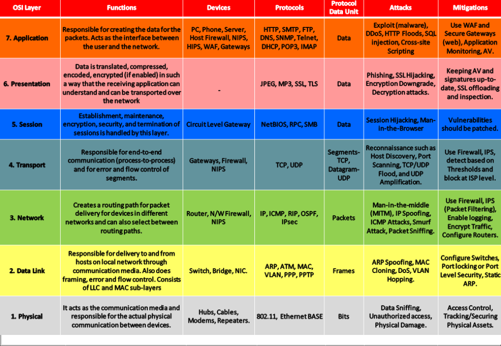
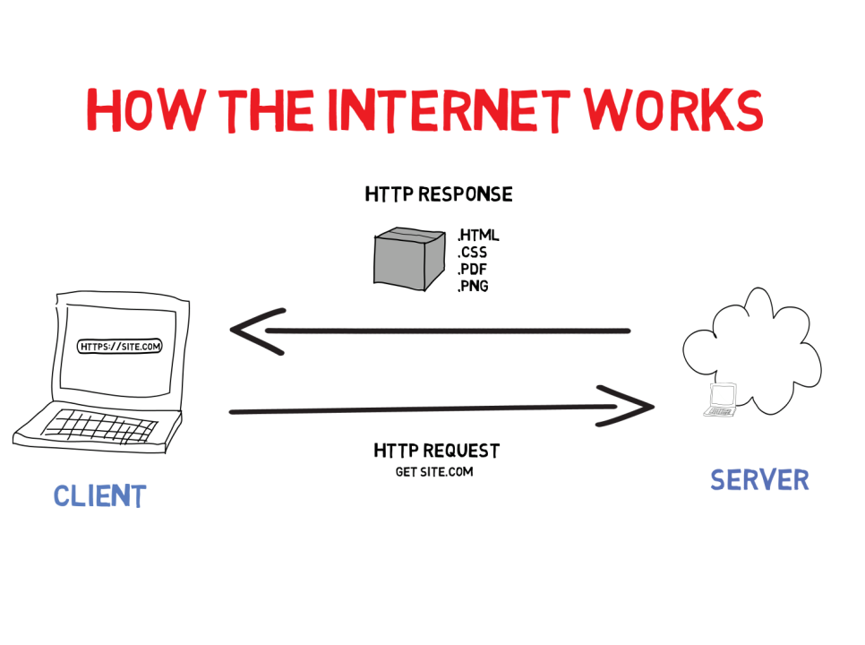
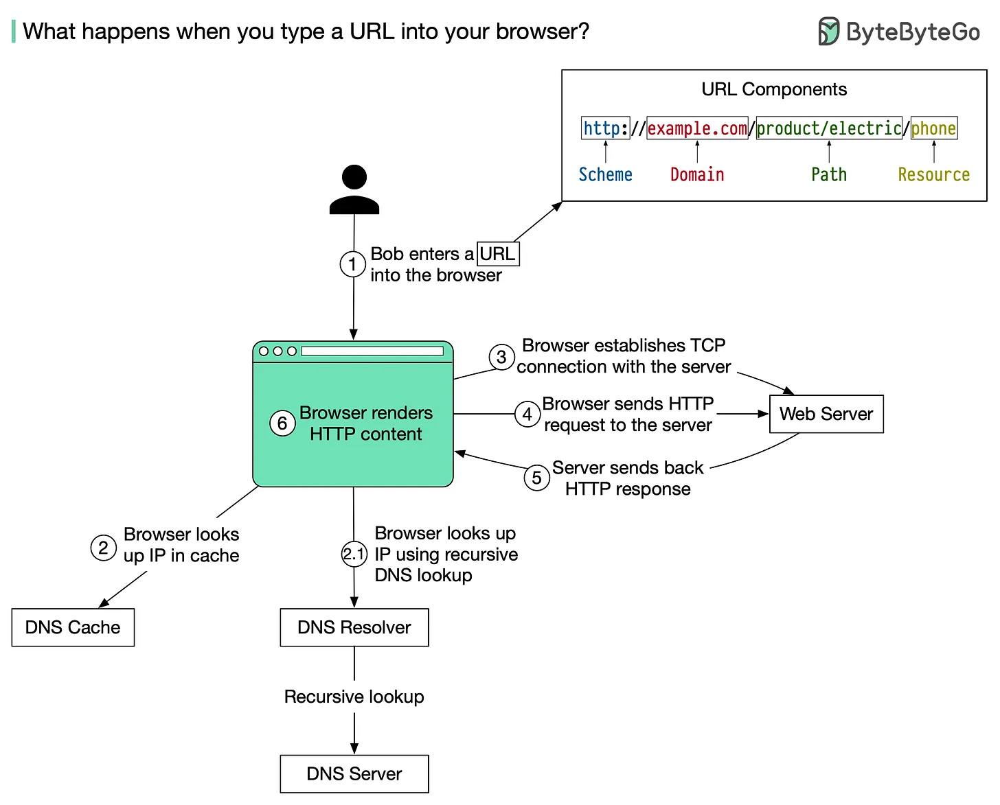
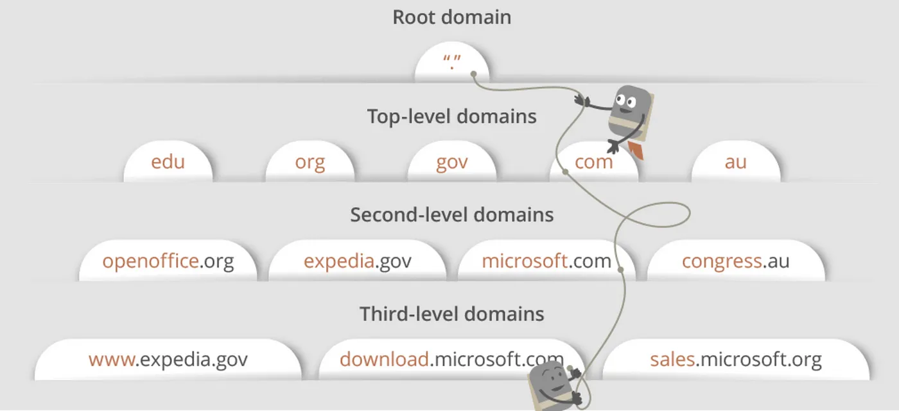

# Networking
**Networking** is the practice of connecting computers and other devices to share resources, exchange data, and communicate over wired or wireless connections.

## Types of Computer Network
**LAN**: Local Area Network(LAN) is a network that covers small area, such office or home.  
**MAN**: Metropolitan Area Network (MAN) is a type of computer network that spans over a metropolitan area, typically a city.  
**WAN**: Wide Area Network(WAN) is a network that covers large geographical area, such as city, country, or even entire world.  

## OSI Model
**Open Systems Interconnection**(OSI) is a reference model that specifies standards for communication protocols and also functionalities of each layer.  

## Networking Devices
- Router: A router is a device that forwards data packets between computer networks, creating an overlay internetwork. It routes the data from the source network to the destination network, based on the IP address in the packet headers.  
- Hub: A hub is a basic networking device that connects multiple Ethernet devices, making them act as a single network segment. It broadcasts incoming data packets to all ports, regardless of the destination.
- Bridge: A bridge is a network device that connects multiple network segments at the data link layer (Layer 2) of the OSI model. It filters traffic and reduces collisions.
- Switch: A network switch is a device that connects devices within a local area network (LAN) and uses MAC addresses to forward data to the correct destination.
- Repeater: A repeater is a network device that regenerates and amplifies signals to extend the distance they can travel over a network.
- Access Point: An access point is a device that allows wireless devices to connect to a wired network using Wi-Fi or related standards. It extends the physical range of a wireless network.
- Gateway: A gateway is a network node that serves as an access point to another network, often involving protocol conversion. It connects different networks and translates data between them.
- Network Interface Card (NIC): A NIC is a hardware component that connects a computer to a network. It provides the physical interface for network connectivity and handles data conversion.
- Firewall: A firewall is a network security device that monitors and controls incoming and outgoing network traffic based on predetermined security rules.

## OSI Model Vs TCP/IP Model

## Network Topology
The **Network Topology** is the layout arrangement of the different devices in a network.
Examples:
- Star
- Mesh
- Point-to-Point
- Ring
- Tree
- Daisy Chain
- Hybrid

## Protocols
A protocol is a set of rules or algorithms which define the way how two entities can communicate across the network.  

1. **Layer 7 Protocols (Application Layer)**
   1. **SOAP** (Simple Object Access Protocol): It is a messaging protocol specification for exchanging structured information in the implementation od webservice in computer networks.
   2. DHCP
   3. DNS
   4. BOOTP (Bootstrap Protocol)
   5. HTTP
   6. HTTPS
   7. NFS (Network File System)
   8. POP3 (Post Office Protocol)
   9. SMTP (Simple Mail Transfer Protocol)
   10. SNMP (Simple Network Management Protocol)
   11. FTP
   12. SFTP
   13. NTP (Network Time Protocol)
   14. IRC (Internet Relay Chat)
   15. Telnet
   16. SSH
   17. IMAP (Internet Message Access Protocol)
2.  **Layer 6 Protocols (Presentation Layer)**
    1.  TLS
    2.  SSL
    3.  LPP (Lightweight Presentation Protocol)
    4.  XDR (eXternal Data Representation)
    5.  X.25
3. **Layer 5 Protocols (Session Layer)**
   1. H.245
   2. iSNS
   3. NetBIOS
   4. RPC
   5. SMB
   6. SMPP
   7. SOCKS
4. **Layer 4 Protocols (Transport Layer)**
   1. iSCSI (Internet Small Computer System Interface)
   2. SCTP (Stream Control Transmission Protocol)
   3. TCP
   4. UDP
   5. QUIC
   6. FCP (Fibre Channel Protocol)
   7. DCCP (Datagram Congestion Control Protocol)
5. **Layer 3 Protocols (Network Layer)**
   1. NAT
   2. IP
   3. ICMP
   4. ARP
   5. IPSEC
   6. OSPF (Open Shortest Path First)
   7. VRRP (Virtual Router Redundancy Protocol)
6. **Layer 2 Protocol (DataLink Layer)**
   1. VLAN

## HOW INTERNET WORKS
  

## What happens when you type google.com in your browser and press Enter
  

1. Bob enters a URL into the browser and hits Enter.  
In this example, the URL is composed of 4 parts:  

    🔹 scheme - http://. This tells the browser to send a connection to the server using HTTP.  
    🔹 domain - example.com. This is the domain name of the site.  
    🔹 path - product/electric. It is the path on the server to the requested resource: phone.  
    🔹 resource - phone. It is the name of the resource Bob wants to visit.  

2. The browser looks up the IP address for the domain with a domain name system (DNS) lookup.  
   To make the lookup process fast, data is cached at different layers: browser cache, OS cache, local network cache, and ISP cache. 

    2.1 If the IP address cannot be found at any of the caches, the browser goes to DNS servers to do a recursive DNS lookup until the IP address is found.  
    2.2 The purpose of a DNS query is to search multiple DNS servers on the internet until it finds the correct IP address for the website.  
    This type of search is called a recursive search since the search will repeatedly continue from a DNS server to a DNS server until it either finds the IP address we need or returns an error response saying it was unable to find it.  
    2.3 The ISP’s DNS server is a DNS recursor whose responsibility is to find the proper IP address of the intended domain name by asking other DNS servers on the internet for an answer.  
    The other DNS servers are called name servers since they perform a DNS search based on the domain architecture of the website domain name.  
    **Domain Architecture**
      
    2.4 For our URL, the DNS recursor will contact the root name server. The root name server will redirect it to the .com domain name server. .com name server will redirect it to the example.com name server.  
    The example.com name server will find the matching IP address for example.com in its’ DNS records and return it to our DNS recursor, which will send it back to our browser.

3. Now that we have the IP address of the server, the browser establishes a TCP connection with the server.

4. The browser sends an HTTP request to the server.  
   The request looks like this:  

    𝘎𝘌𝘛 /𝘱𝘩𝘰𝘯𝘦 𝘏𝘛𝘛𝘗/1.1
    𝘏𝘰𝘴𝘵: 𝘦𝘹𝘢𝘮𝘱𝘭𝘦.𝘤𝘰𝘮

5. The server processes the request and sends back the response. For a successful response (the status code is 200).  
   The HTML response might look like this:  

    𝘏𝘛𝘛𝘗/1.1 200 𝘖𝘒
    𝘋𝘢𝘵𝘦: 𝘚𝘶𝘯, 30 𝘑𝘢𝘯 2022 00:01:01 𝘎𝘔𝘛
    𝘚𝘦𝘳𝘷𝘦𝘳: 𝘈𝘱𝘢𝘤𝘩𝘦
    𝘊𝘰𝘯𝘵𝘦𝘯𝘵-𝘛𝘺𝘱𝘦: 𝘵𝘦𝘹𝘵/𝘩𝘵𝘮𝘭; 𝘤𝘩𝘢𝘳𝘴𝘦𝘵=𝘶𝘵𝘧-8

    <!𝘋𝘖𝘊𝘛𝘠𝘗𝘌 𝘩𝘵𝘮𝘭>
    <𝘩𝘵𝘮𝘭 𝘭𝘢𝘯𝘨="𝘦𝘯">
    𝘏𝘦𝘭𝘭𝘰 𝘸𝘰𝘳𝘭𝘥
    </𝘩𝘵𝘮𝘭>

6. The browser renders the HTML content.